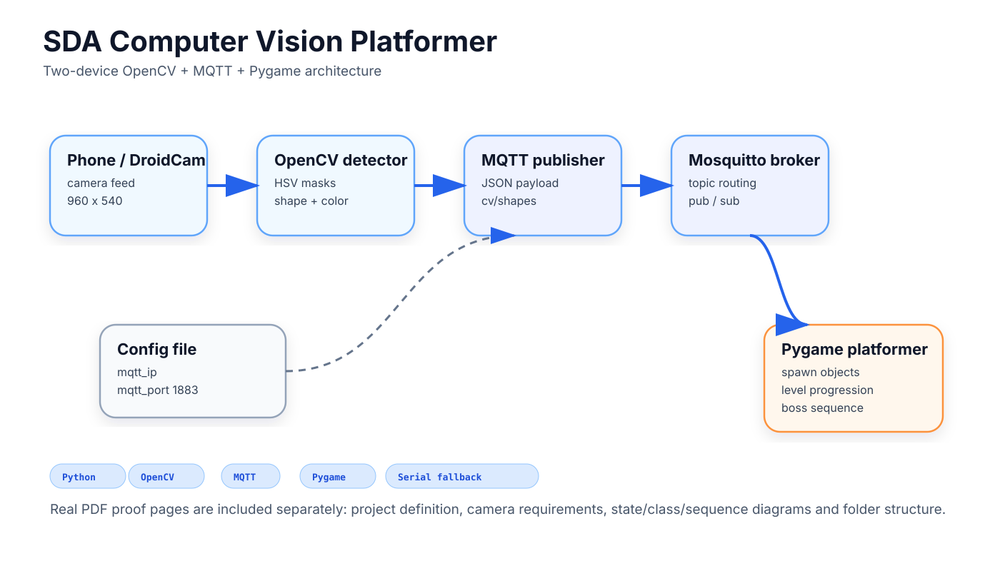
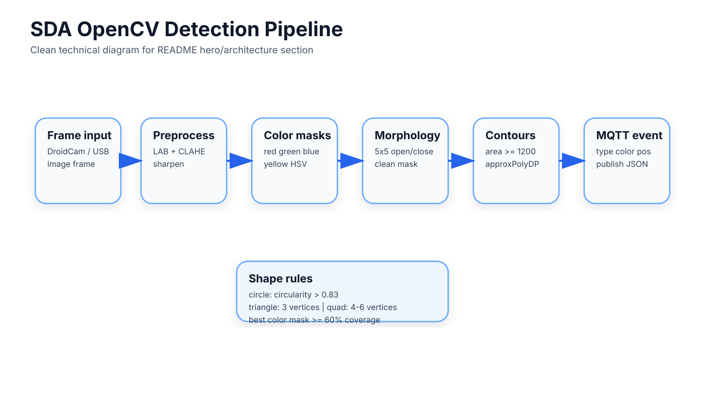
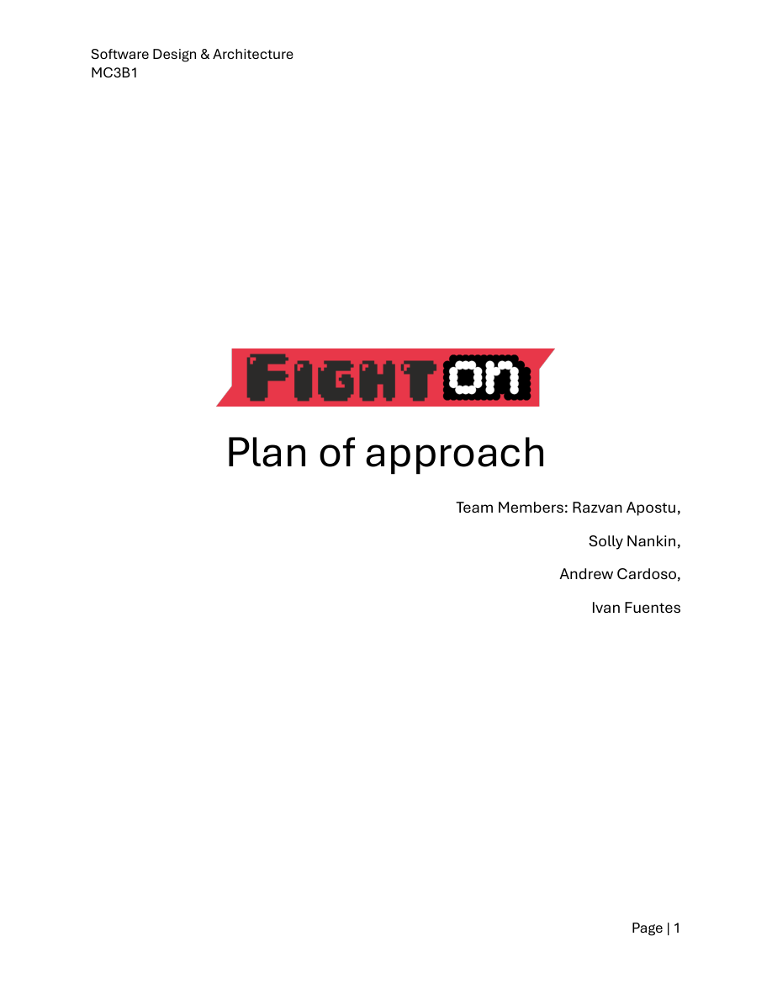
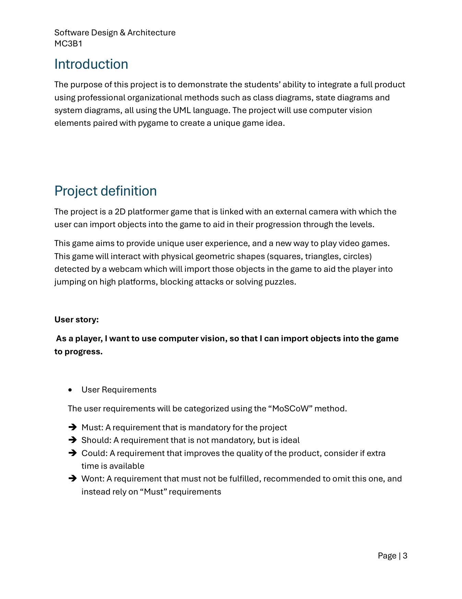
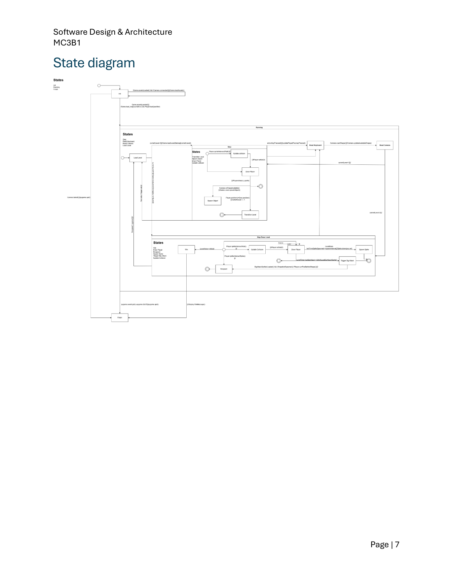
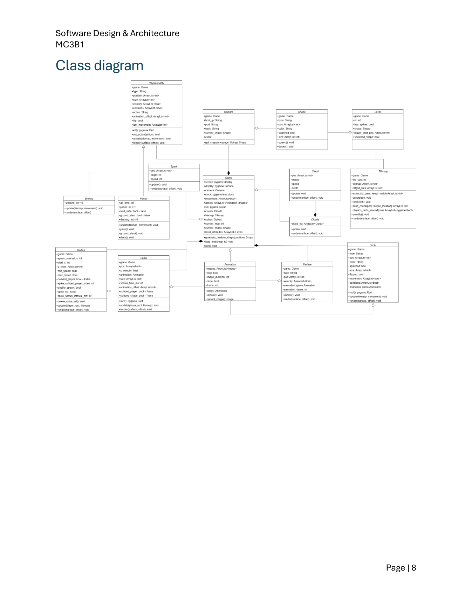
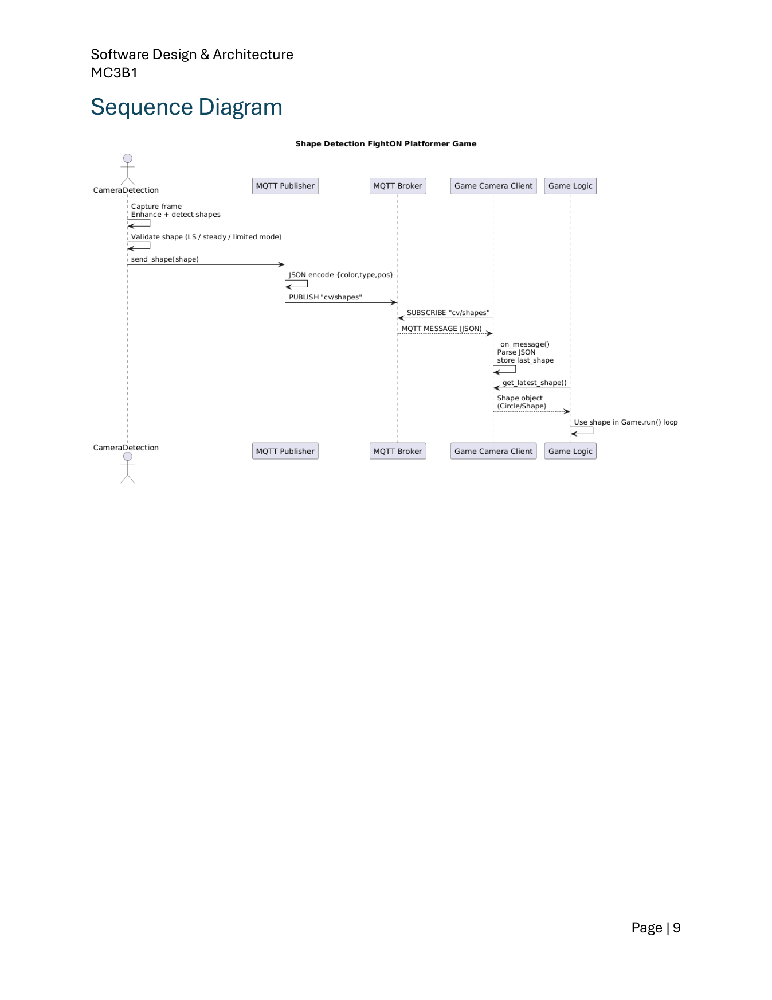
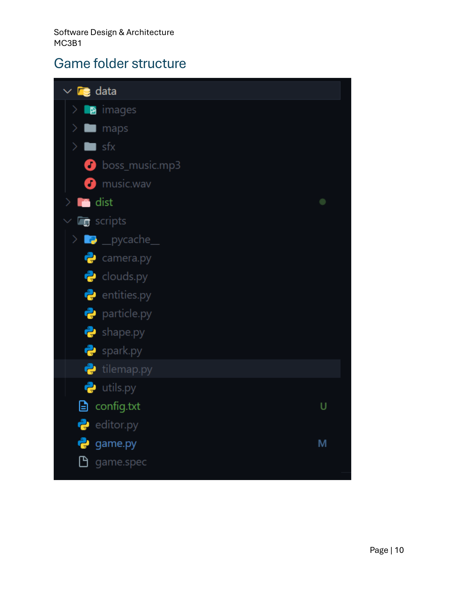

# Computer Vision Platformer

<p align="center">
  
</p>

A multi-device 2D platformer where real-world geometric shapes detected through a camera are converted into in-game objects and progression triggers. The project combines a Pygame platformer, an OpenCV shape-and-color pipeline, MQTT messaging, and serial-linked device workflows.

## System architecture

<p align="center">
  
</p>

## System at a glance

| Area | Details |
| --- | --- |
| Stack | Python, Pygame, OpenCV, MQTT, Serial |
| Game runtime | `640x480` at `60 FPS` |
| Structure | `4 levels`, including a boss sequence |
| Messaging | Topic `cv/shapes` with `color`, `type`, and `pos` |
| Vision target | Detect squares, triangles, and circles with color awareness |
| Confirmation logic | LS mode with `CONFIRM_TIME = 0.5` |

## CV pipeline

<p align="center">
  
</p>

## Implementation notes

### Camera and detection

- The camera side tries DroidCam first and can fall back to other available cameras.
- The detection path uses HSV masks for red, green, blue, and yellow.
- A `5x5` morphology close/open pass cleans the combined mask.
- Minimum contour area is `1200`.
- The preprocessing path uses LAB conversion, CLAHE, and a sharpen step before contour analysis.
- Shapes are classified with `approxPolyDP(c, 0.025 * perimeter, True)` plus circularity checks.
- Circles use a circularity threshold above `0.83`; triangles use `3` vertices; quadrilaterals accept `4-6` vertices.
- Color assignment picks the strongest valid mask only when it covers at least `60%` of the candidate contour.

### Game integration

- The game reads `mqtt_ip` and `mqtt_port` from config files.
- The MQTT topic is `cv/shapes`.
- Payloads contain `color`, `type`, and `pos`.
- The game maps detected shapes into Pygame objects and flips `spawned_shape = True` when the right shape reaches the current level logic.
- The repo code shows `TOTAL_LEVELS = 4`, a `FRAMERATE = 60`, and a boss-timed sequence in the third gameplay stage.

### Course-deliverable evidence reflected in the repo

- Python, Pygame, OpenCV, MQTT, keyboard and mouse control
- At least `10` OOP classes plus state, class, and sequence diagrams
- A 2D platformer linked to an external camera
- Real geometric shape import into gameplay progression
- Shape and color detection for squares, triangles, and circles

<details>
<summary><strong>Official SDA PDF proof pack</strong> — title page, requirements, UML, sequence, and folder structure</summary>

<br/>

<table>
  <tr>
    <td width="50%" valign="top">
      <br/>
      <strong>Official PDF title page</strong>
    </td>
    <td width="50%" valign="top">
      <br/>
      <strong>Project definition</strong>
    </td>
  </tr>
  <tr>
    <td width="50%" valign="top">
      <br/>
      <strong>Camera requirements</strong>
    </td>
    <td width="50%" valign="top">
      <br/>
      <strong>State diagram</strong>
    </td>
  </tr>
  <tr>
    <td width="50%" valign="top">
      <br/>
      <strong>Class diagram</strong>
    </td>
    <td width="50%" valign="top">
      <br/>
      <strong>Sequence diagram</strong>
    </td>
  </tr>
  <tr>
    <td width="50%" valign="top">
      <br/>
      <strong>Game folder structure</strong>
    </td>
    <td width="50%" valign="top">
      Proof pages are copied locally from the v4 pack so this README does not depend on external raw asset repos.
    </td>
  </tr>
</table>

</details>

## Run

Install the Python dependencies with Python 3.x:

```bash
pip install opencv-python paho-mqtt pygame pyserial
```

Start the game:

```bash
python game/game.py
```

Run the camera or vision side from the `camera/` folder.

## Limitations and next improvements

- The README uses architecture diagrams and official documentation pages, not fabricated gameplay screenshots.
- HSV thresholds are tuned for a fixed lighting scene; a calibration step is not yet implemented.
- LS-mode confirmation with `CONFIRM_TIME = 0.5` is a deliberate latency floor; reducing it would increase false positives.
- DroidCam-first capture order is hard-coded, so switching cameras currently needs a config change.
- A future pass could add real in-game captures if they are committed and verifiable.
- The current proof is strongest in architecture, requirements, and repo-structure evidence rather than polished final-demo imagery.
- Runtime HSV calibration, tighter MQTT reconnect handling, and an OOP class summary table would make the repo easier to inspect without opening the PDF.
